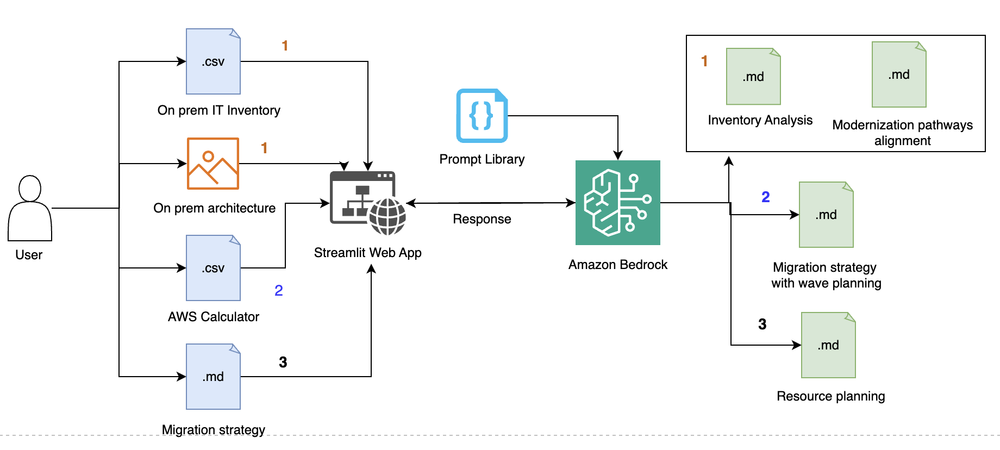

## Overview

This sample repository illustrates the application of Generative AI (Gen AI) during the AWS Migration Acceleration Program (MAP) assessment phase, following the completion of on-premises discovery. It showcases capabilities that enhance migration planning, cost optimization, identification of modernization opportunities, and resource planning—processes which were previously both time-consuming and complex.

## Features

### 1. Modernization Opportunity Analysis

- Analyzes on-premises architecture and infrastructure data
- Identifies [modernization pathways](https://aws.amazon.com/blogs/migration-and-modernization/move-to-ai-pathway/) with corresponding AWS cost projections
- Supports CSV inventory data and architecture image analysis
- Provides AWS service recommendations

### 2. Migration Strategy Development

- Creates data-driven migration patterns and wave planning
- Generates cumulative spend forecasts and $50k milestone predictions
- Processes AWS Calculator CSV exports
- Accelerates migration timeline development

### 3. Resource Planning

- Develops detailed team structures and resource allocation plans
- Provides five key outputs:
  - Executive summary
  - Team structure evaluation
  - Resource summary
  - Wave-based planning
  - Role-based resource allocation
- Supports Hub-and-Spoke and Wave-Based team models

### 4. Prompt Library
The Prompt Library is a collection of prompts designed to accelerate their Gen AI adoption across migration and modernization phase. It includes a structured prompt library with pre-built templates for each use case. These templates are designed to be reviewed and tailored to your specific requirements.

#### Modernization Cost and Analysis Prompts

- **Inventory Analysis Template**: High level IT inventory analysis across multiple technology domains
- **Modernization Pathways Template**: AWS Cost inline with modernization pathways approaches with customizable AWS service preferences and cost estimation parameters
- **Architecture Analysis Template**: Processes on-premises architecture diagrams and provide analysis across key domains (compute, network, database, security and monitoring)

### Migration Strategy Prompts

- Generates three migration approaches, compares patterns to identify consistent strategic elements and synthesizes optimal final strategy from cross-pattern analysis
- Creates structured migration waves and cost projection methodology
- Predicts $50,000 USD milestone achievement with adjustable acceleration strategies

### Resource Planning Prompts

- Evaluates Hub-and-Spoke vs Wave-Based team models, calculates effort estimates using customizable utilization rates and team pod sizes, generates role-based resource allocation with adjustable contingency factors

> 💡 **Prompt Customization**: Review the README files in each `prompt_library/` subdirectory to understand default assumptions and learn how to customize prompts for your specific organizational requirements.


## High level process



## Technology Stack

- **Frontend**: Streamlit for interactive web interface
- **AI/ML**: Amazon Bedrock with Claude 3.7 Sonnet models
- **Data and Image Processing**: Pandas, PyMuPDF for document processing

## Prerequisites

### AWS Requirements

- An [AWS account](https://aws.amazon.com/)
- Amazon Bedrock access with Claude model permissions in AWS region US East (N. Virginia) *us-east-1* for this code.
- [AWS Command Line Interface (AWS CLI)](https://aws.amazon.com/cli/)
- Python (version 3.8 or later)
- [AWS CLI configured](https://docs.aws.amazon.com/cli/v1/userguide/cli-chap-configure.html) to interact with AWS services using commands in command-line shell

## Quick Start

### 1. Clone the Repository

``` Python3
git clone <repository-url>
cd map-genai-usecases-aws-sample
```

### 2. Install Dependencies

``` Python3
pip install -r requirements.txt
```

### 3. Configure AWS Credentials

``` bash
# Option 1: AWS CLI
aws configure

# Option 2: Environment Variables
export AWS_ACCESS_KEY_ID=your_access_key
export AWS_SECRET_ACCESS_KEY=your_secret_key
export AWS_DEFAULT_REGION=us-east-1
```

### 4. Enable Bedrock Models

Ensure you have access to the following model in [Amazon Bedrock](https://docs.aws.amazon.com/bedrock/latest/userguide/models-supported.html):

- Anthropic Claude 3.7 Sonnet (`us.anthropic.claude-3-7-sonnet-20250219-v1:0`)

### 5. Review Configuration in utils/config.py

Before running the application, review the configuration settings in `utils/config.py`:

- **AWS Region**: Defaults to `us-east-1` (can be overridden via `AWS_REGION` environment variable)
- **Amazon Bedrock Model**: Claude 3.7 Sonnet (`us.anthropic.claude-3-7-sonnet-20250219-v1:0`) and model parameters
- **Timeout Settings**: 5-minute read timeout, 60-second connection timeout
- **File Processing**: Supports PNG images and CSV data files
- **Sample Data**: Resource profile template for the usecae 'Resource Planning' available at `sampledata/resource_profile_template.csv`

Key configuration functions:

- `get_aws_region()`: Returns configured AWS region
- `get_model_config()`: Returns model parameters for Claude 3.7

### 6. Review Prompt Library

Before running the application, review the default prompt templates in the `prompt_library/` directory to ensure they align with your specific requirements:

**Modernization Opportunity Prompts** (`prompt_library/modernization_opportunity/`):
- `inventory_analysis_prompt.py` - High level inventory analysis 
- `modernization_pathways_prompt.py` - The modernization pathways and cost estimation parameters
- `onprem_architecture_prompt.py` - Architecture analysis across different domains

**Migration Strategy Prompts** (`prompt_library/migration_patterns/`):
- `migration_patterns_prompt.py` - The migration pattern approaches and wave planning methodology

**Resource Planning Prompts** (`prompt_library/resource_planning/`):
- `resource_planning_prompt.py` - Resource planning, team structure and delivery cost

> 💡 **Prompt Customization Tip**: Each prompt library includes detailed README files explaining input parameters, expected outputs, and customization options. Review these files to understand how to tailor prompts for your specific migration methodology, cost models, and resource planning approaches.


### 7. Run the Application

``` Python3
streamlit run home_page.py
```

The application will be available at `http://localhost:8501`

## Usage Guide

### Modernization Opportunity Analysis

1. **Review Default Prompts**: Check `prompt_library/modernization_opportunity/README.md` for customization options
2. Navigate to the "Modernization Opportunity" page
3. Upload your IT inventory CSV file
4. Define the scope of modernization
5. Optionally upload an on-premises architecture image (JPG, JPEG, PNG formats)
6. Review modernization recommendations


### Migration Strategy Development

1. **Review Default Prompts**: Check `prompt_library/migration_patterns/README.md` for wave planning and cost projection customization
2. Go to the "Migration Strategy" page
3. Upload AWS Calculator CSV export
4. Define migration parameters and constraints
5. Generate comprehensive migration wave planning
6. Review cost projections and milestone predictions
7. (optionally) Download the migration strategy document which is useful for the use case 'Resource Planning'

### Resource Planning

1. **Review Default Prompts**: Check `prompt_library/resource_planning/README.md` for team structure and utilization customization
2. Access the "Resource Planning" page
3. Upload migration strategy document with wave planning generated using "Migration Strategy" page
4. Review resource profile template (see /sampledata/resource_profile_template.csv) and include resource profile data
5. Generate detailed team structure recommendations
6. Analyze resource allocation and planning outputs

## Important Notes

> 💡 **AI Accuracy Disclaimer**: Whilst GenAI provides valuable insights, it might occasionally produce non-deterministic outcomes due to its probabilistic nature. Always validate and double-check AI-generated recommendations before implementation.

> 💡 **This solution is explicitly designed for proof-of-concept purposes** only to explore the art of possibility with Generative AI for MAP assessments. Please adhere to your company's enhanced security and compliance policies

### Best Practices

- Validate all Generative AI-generated recommendations with domain experts
- Test with your specific data like IT inventory data (e.g., server lists, application catalogs), On-premises architecture diagrams,AWS Calculator and Resource profile data
- Monitor AWS costs
- Optionally, use the following guidance to containerise the Streamlit App using Amazon Elastic Kubernetes Service (Amazon EKS)
  - Build the Docker image and push this Docker image to Amazon Elastic Container Registry (Amazon ECR)
  - Define Kubernetes deployment and service manifests
  - Set up Amazon Elastic Kubernetes Service (EKS) cluster and Fargate profile
  - Configure Amazon CloudFront and Application Load Balancer
  - Set up an AWS CodePipeline with AWS CodeBuild (i.e build the Docker image, push it to ECR, and apply the Kubernetes manifests.) to automate the deployment process
  - **Set up Amazon Virtual Private Cloud (Amazon VPC) with enhanced security features and configure subnets, route tables, and security groups. Implement IAM roles using principle of the least privilege, encryption, network policies, and VPC flow logs to enhance security. Use CloudWatch for comprehensive logging, metrics, alarms, and dashboards to ensure your application runs smoothly and efficiently.**

## Cost

- [Amazon CloudWatch](https://docs.aws.amazon.com/bedrock/latest/userguide/monitoring.html) to monitor runtime metrics for Bedrock applications, providing additional insights into performance and cost management
- Implement caching for repeated analyses
- Amazon Bedrock [supports foundation models (FMs)](https://docs.aws.amazon.com/bedrock/latest/userguide/models-supported.html) from providers like Anthropic, Amazon, AI21 Labs, Cohere, DeepSeek,Luma AI, Meta, Mistral AI, OpenAI, Stability AI and others. Use appropriate model sizes for different use cases
- Consider compute reserved capacity for high-volume usage

## Contributing

1. Fork the repository
2. Create a feature branch (`git checkout -b feature/amazing-feature`)
3. Commit your changes (`git commit -m 'Add amazing feature'`)
4. Push to the branch (`git push origin feature/amazing-feature`)
5. Open a Pull Request

## License

This project is licensed under the MIT License - see the LICENSE file for details.

## Support

For support and questions:

- Create an issue in the GitHub repository
- Review the AWS Bedrock documentation
- Check Streamlit documentation for UI-related issues
